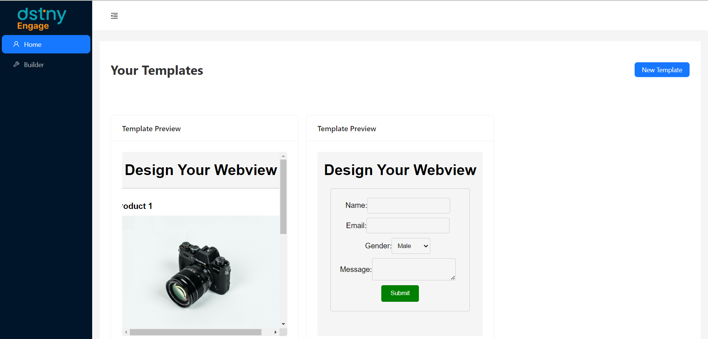

# Flow for Managing Templates with API

This document outlines the flow for managing templates on a web application, including creating, updating, publishing, and viewing templates using various API endpoints.

## Home Page

The home page of the application serves as the central hub for template management.

### Display Templates

1. Upon loading the home page, all templates created using an API are fetched from `http://localhost:3001/templates`.

2. The retrieved templates are displayed on the home page, allowing users to see the list of available templates.



### Create New Template

1. To create a new template, the user provides a name for the template.

2. The user submits the form, triggering an API request to create the template. The API should accept the user-defined name as input.

3. After successfully creating the template, the user is redirected to the template builder at `http://localhost:5173/builder/{templateId}`. The `{templateId}` parameter represents the unique identifier for the newly created template.

## Template Builder

In the template builder, users can design their templates by dragging and dropping components onto the canvas.

### Update Template

The following code snippet demonstrates how to update the template with HTML and CSS:

Certainly, here are the most important parts of the provided code:

1. **Data Preparation:**

   ```javascript
   const htmlContent = editor.getHtml();
   const externalCssUrls = editor.getConfig().canvas.styles;
   ```

   This code retrieves the HTML content and a list of external CSS URLs from the editor. It prepares the data needed to update the template.

2. **Fetching External CSS:**

   ```javascript
   const fetchCssPromises = externalCssUrls.map((url) =>
     fetch(url).then((response) => response.text())
   );
   ```

   This part of the code initiates multiple asynchronous requests to fetch external CSS stylesheets associated with the template. It creates an array of promises for fetching these CSS files.

3. **Combining CSS Styles:**

   ```javascript
   Promise.all(fetchCssPromises)
     .then((externalCssArray) => {
       // Combine external and internal CSS into a single <style> block
       const internalCss = editor.getCss();
       const combinedCss = externalCssArray.join("\n") + "\n" + internalCss;
       const updatedStyles = `<style>${combinedCss}</style>`;
       // ...
     })
     .catch((error) => {
       console.error("Error fetching external CSS:", error);
       message.error("Error fetching external CSS");
     });
   ```

   Here, it waits for all the CSS files to be fetched successfully and then combines them with any internal CSS generated by the editor. This combined CSS is encapsulated in a `<style>` block.

4. **Updating the Template via API:**

   ```javascript
   fetch(`http://localhost:3001/update/${templateId}`, {
     method: "PATCH",
     headers: {
       "Content-Type": "application/json",
     },
     body: JSON.stringify({ content: htmlContent, style: updatedStyles }),
   })
     .then((response) => response.json())
     .then((data) => {
       message.success("Template updated successfully");
     })
     .catch((error) => {
       console.error("Error updating template:", error);
       message.error("Error updating template");
     });
   ```

   This section sends an HTTP PATCH request to update the template's content and styles on the server. It includes the HTML content and the combined CSS styles. Successful and error responses are handled, and appropriate messages are displayed.

These key sections together form the core logic for updating a template's content and styles using data from the GrapesJS editor and sending it to a specified API endpoint.

### Publish Template

1. After designing the template, the user decides to publish it.

2. An API request is sent to `http://localhost:3001/publish/{templateId}` to publish the template with the specified `{templateId}`.

3. The published template is now available for viewing.

## Viewing a Template

Users and visitors can view a published template.

1. To view a published template, simply access the template's URL, which would typically be something like `http://localhost:3001/publish/{templateId}`.

2. The template is displayed in the browser for users to interact with and consume.

This flow allows users to easily create, update, publish, and view templates within the application using a combination of APIs and a template builder interface.
